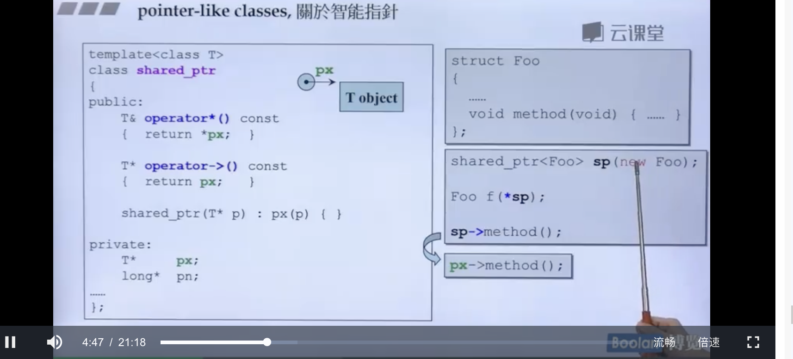

# 第四课 参数传递与返回值
## 1.在类里面的内联函数最好加一个const，使得成员函数为常量。
## 2.参数传递尽量传递用引用（const），而不是传值
好处就是以指针的速度传递，效果更快，同时使用const 不需要对方改，程序更加合理。加入const表示不要对引用的量修改，否则编译会报错，而如果不加const就可以修改。
## 3.返回值传递：return by value vs return by reference（to const） 
那什么时候不能使用by reference呢？
一个函数的操作运算结果，放在什么位置？
1.函数必须放到另一个位置，这个时候就不能by reference
因为这个量如果是local变量，一旦函数结束的话，这个量就没有了，所以不能传引用，其余结果都可以传引用。
2.函数放到一个传过来的函数里面，
也是最好使用传引用，更好一点。（细节后面再谈）
## 4.友元的使用
同一个class的各个object互为frienss（友元）
# 第五节课 操作符重载和临时对象
## 操作符重载
所有的成员函数一定带着一个隐藏的参数，这个参数是this，
this是一个指针，所以编译器会自动将+=左边的地址自动传到参数里面，但是这个this不能写出来，是吟隐藏的。
比如
c2+=c1;
## return by reference
传递者无需知道接收者是以reference的形式来接收的。
比如 
c2+=c1，
而operator的+=（const complex& r)
这里接收可能用value，也可以用引用
同时比如

 看图分析，返回的complex后面使用了引用符号
 同时+=的返回类型不能是void，是为了防止连等出现问题 。
+ 引入 inline 关键字的原因
在 c/c++ 中，为了解决一些频繁调用的小函数大量消耗栈空间（栈内存）的问题，特别的引入了 inline 修饰符，表示为内联函数。栈空间就是指放置程序的局部数据（也就是函数内数据）的内存空间。在系统下，栈空间是有限的，假如频繁大量的使用就会造成因栈空间不足而导致程序出错的问题，如，函数的死循环递归调用的最终结果就是导致栈内存空间枯竭。

## 操作符重载的非成员函数版本

没有this，是全局函数（global）
### 图片的这些函数绝不可以return by reference
因为这三个函数里的那个return的东西都是函数内的产生的量，是local的相对于函数的量，这时我们一定要by value。
因为他们返回的必定是一个local object。
 也就说这是一个临时对象。
 typename（）这个语法其实很常见。
 操作符重载

直接看图
另外关于
<< 这个不可以定义成类的成员函数

返回值仍然是cout，最优先就是引用，并且函数前不能+const
# 第六节课 复习Complex类的实现过程
complex operator + 
,像operator的+ 一般不设为成员函数，创建新的object，类的名称后面加小括号，是一个local变量，所以最后返回的不能是引用。
# 第七节课：拷贝构造函数，拷贝赋值，析构函数
如果类里面有指针，一定要自己写拷贝构造函数和赋值函数

一般而言，让字符串里面设计一个指针，动态分配的方式，
然后new的话 一定记得要delete，
class with pointer members必须要有自己写的copy ctor和copy oper
如果不自己写，不new的话，
就会发生两个指针指向同一块！内存泄漏情况出现，
两个指针指向同一快是危险的事情，称之为浅拷贝，改变一个另一个会受影响。
新创建出来的 就要调用构造函数，深拷贝，

这个拷贝复制函数就一般是这么写的，
第二行的自我赋值，是功力高深的人才这么写的，效率高
如果你没写自我赋值的话，甚至可能出错，

这个一开始就同时指向同一快，你现在delete，就会导致什么结果呢
就会产生不确定性后果！

所以一定要写！
# 第八节课：堆，栈和内存管理

首先说 stack，是存在于某作用域的一块内存空间。例如当你调用函数，函数本身即会形成一个stack用来放置它所接收的参数，以及返回地址。
在函数本身内声明的任何变量，其所使用的内存块都取自stack，
heap，是由，操作系统提供的一块global内存空间，
程序可以动态分配从某中获得若干blocks（区块）。
## stack object的生命期是只要离开作用域，析构函数就会被调用，所以又称为auto object，自动清理内存。
另外如果在作用域内加一个static object，其生命在作用域结束以后仍然存在，直到整个程序结束。
还有一种对象叫做全局对象，global object，其生命在整个程序结束以后才结束。
## heap的生命期

看这个，这就是内存泄漏：
你在new 是先分配memory，再调用ctor
delete 先调用ctor ，再释放memory。
动态分配所得的内存块，在vc上：

array new 要搭配 array delete 不然会出错。

直接看图即可，再三告诫大家要搭配delete [];
会内存泄漏.
# 第九节课：复习string类的实现过程：
  
`
  
  class String
{

public:

    String(const char* cstr=0);

    String(const String&str);
    String& operator=(const String &str);
    ～String();
    char* get_c_str() const {
        return m_data;
    }

private:
     char* m_data;

}`

`
        
      inline  String::String(const char*str=0){
        if(cstr){
             m_data=new char[strlen(str)+1];
             strcpy(m_data,cstr);
         };
         else{
            m_data=new char[1];
            *m_data='\0';
         }
}

`
`
      
     String::~String(){
        delete []m_data;
      };
    inline String::String(const String&str){
        m_data= new char[strlen(str.m_data)+1];
        strcpy(m_data,str.m_data);
     }

`

这里写内联函数，无所谓反正没关系！
`
        
    inline  
    String& String::operator=(const String&str){
        if(this==&str){
            return *this;
        }//这里的str前面的&是取地址，前面那个是引用，它们的意义不一样！
        
        delete []m_data;
        m_data=new char[strlen(str)+1];
        strcpy(m_data,str.m_data);
        return *this;
    }
`
# 第十节课：类模版。函数模版，及其他
## static补充：
静态函数没有this pointer，只能处理静态变量:
;
看这个，
调用静态函数的方式通过调用对象来调用，
也可以通过class name来调用。
进一步补充：把ctors放在private里:

革命尚未成功，同志还需努力！
# 第十一节课: 组合和继承
对于继承来说:
派生类的构造函数首先调用基类的default构造函数，然后才能执行自己。
而析构函数是由外而内的，
派生类的析构函数首先执行自己，然后才能调用基类的析构函数。

## 引用计数 Delegation（委托）

左边不用改，只用改右边的，这叫编译防火墙！Handle/Body（pImpl）
三个人共享同一个hello，
a如果改变hello，不能影响bc，
那a要改，我们就copy一份让a来改，剩下的hello让bc共享，叫copy on right。
(走远了)
## 继承关系下的构造和析构
子类的对象里有父类的成分在里面:
继承 with 虚函数
继承需要搭配虚函数。
# 第12课:虚函数和多态
non-virtual函数:你不需要派生类重新定义（override）它。   
virtual函数:你希望派生类的class重新定义覆盖它，并且你对这种函数已经有默认定义。    
pure virtual函数:你希望派生类一定要重新去定义它，你对他没有默认定义。  
  .

  这里执行到Serialize()的时候，
  看到子类有写virtual的时候，
  就执行子类的这个虚函数里面的东西，
  这个做法很经典，将基类的这个抽象函数暂时延缓，等到子类写出来，这是 Template Method。
  我先帮你想好，你想设计一个应用程序，功能是差不多的，大家写程序的拼搏的部分不在于这些部分，而是知识领域，这个部分就叫框架，这种框架就大量用到了这种Template Method
举个例子:
;
这个例子就是这样，子类函数写一个虚函数，这样父类函数调用的时候，看到是虚函数，就去调用子类新写的。

# 第13课 委托相关设计
c++里面你要放指针，指针是一样的大小,   
你不能放东西,

如图所示,
这样的设计模式，称之为Composite:
另外的委托和继承:Prototype
太难了 呜呜呜呜呜
# 第14课 导读:
探索 this 指针，vptr虚指针，虚表，虚机制，以及虚函数造成的多态效果。
# 第15课 转换函数:
没有返回类型
  
        class Fraction
     {
      public:
        Fraction(int num,int den=1):m_numerator(num),m_denominator(den) {};
        operator double() const {
          return (double) m_numerator/m_denomonator;
        }
      private:
        int m_numerator //分子;
        int m_denominator
     };
           Fraction f(3,5);
         double d=4+f;//调用 operator double()将f 转换为double类型
//看下面这个,转换的方向不同。
      
      
        class Fraction
     {
      public:
        Fraction(int num,int den=1):m_numerator(num),m_denominator(den) {};
        Fraction operator +(const Fraction &f){
          return Fraction(...);
        }
      private:
        int m_numerator //分子;
        int m_denominator
     };
     Fraction f(3,5);
     Fraction d2=f+4;//调用了构造函数将4专为Fraction(4,1);

//如果现在的代码是这样的: 
          
           class Fraction
        {
      public:
        Fraction(int num,int den=1):m_numerator(num),m_denominator(den) {};
        operator double() const {
          return (double) m_numerator/m_denomonator;
        }
        Fraction operator +(const Fraction &f){
          return Fraction(...);
        }
      private:
        int m_numerator //分子;
        int m_denominator
     };
        Fraction f(3,5);
         Fraction d2=f+4;//[Error]ambiguous

如果代码之前加一个explict

         class Fraction
        {
      public:
       explict Fraction(int num,int den=1):m_numerator(num),m_denominator(den) {};
        operator double() const {
          return (double) m_numerator/m_denomonator;
        }
        Fraction operator +(const Fraction &f){
          return Fraction(...);
        }
      private:
        int m_numerator //分子;
        int m_denominator
     };
        Fraction f(3,5);
         Fraction d2=f+4;//[Error] conversion from ‘double’ to ‘Fraction’

explict这个关键词几乎用在构造函数面前。
# 第14课:pointer-like classes 关于智能指针

看这个图:
# 第15课 function-like classes 所谓仿函数

看这个代码:
你只要看到一种class，里面有operator(),我们就说这种class就是一种仿函数，
# 第16，17，18
介绍类模版，函数模版和namespaces的经验谈
函数模版 
#  19.成员模版

外头的类是模版，里面的一个成员又可以允许变化。

想一下,把鲫鱼和麻雀放到一个pair是鱼类和鸟类组成的pair中，可以吗？
当然可以！！
右边的代码里面的那个template的构造函数就是这样的，

# 20.模板模板参数
# 21.C++ 标准库
迭代器,容器,算法,仿函数
比如: 
+ array
+ vector
+ deque
+ forward_list
+ list
+ stack
+ queue
+ priority_queue
+ set
+ multiset
+ map
+ multimap
无序的set，multiset，map，multimap

## 算法
排序 查找 等等, 通通要用一遍,自己去测一遍，用一下最好，
# 引用
reference
# 复合&继承关系下的构造和析构函数

继承关系下的构造和析构
Derived的构造函数首先调用base的默认构造函数，
然后才执行自己的。 
Derived::Derived(...):Base() {...}; 
析构是由外而内的, 
Derived的析构函数首先执行自己，然后才调用base的析构函数，
# 关于Dynamic Binging
## 谈谈 const
> 当成员函数后面放一个const,表示不打算改变类里面的数据 
> 
    

    const String str("aas");
    str.print();

  如果当初设计string::point()并未指明const,那么1上一行就是由const object调用non-const function,这会出错，这不是我们想要的

 +  当成员函数的const和non-const版本同时存在时，const object只能调用const版本，non-const object只能调用non-const版本
  

## 关于new和delete
 + 当一个对象有虚函数,他就多一个指针，在该对象中

# 容器分类与各种测试
+ Sequence Containers
  > Array
  > Vector
  > Deque
  > List
  > Forward-List
+ Ascoaiative Containers
  > Set/Multiset
  >Map/Multimap
+ unordered Containers
 > Unordered Set/Multiset
 > Unordered Map/Multimap
 